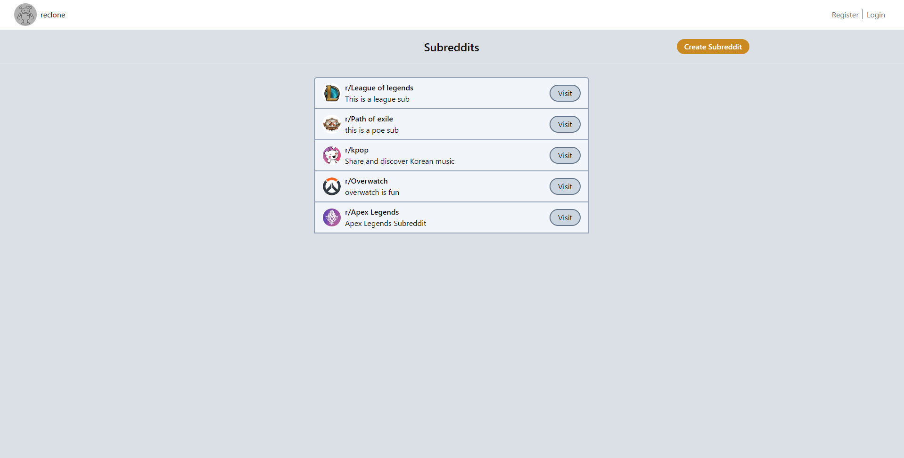
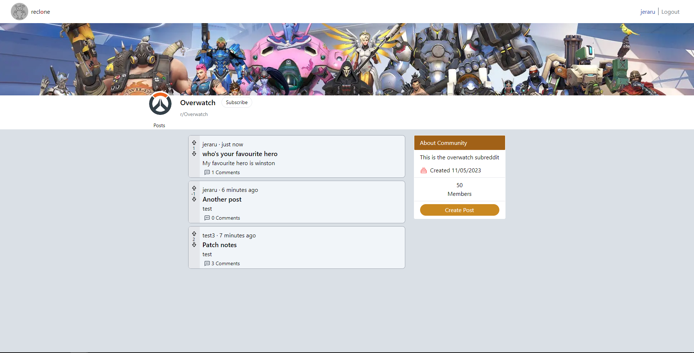
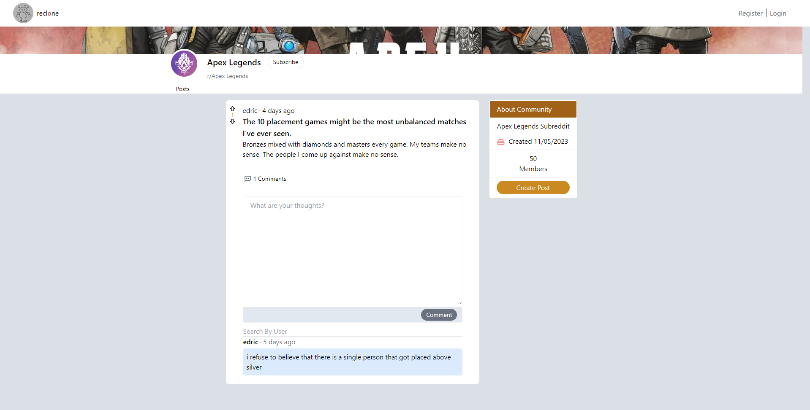

# Reddit-clone-nextjs

## Preview

### Desktop
#### Home Page



#### Subreddit Page



#### Post Page




## Deployed Version

* [Link]( https://reddit-clone-edric.vercel.app/)

## Setup

* To install dependencies open terminal cd into the root folder
 ```
 npm install
 ```
 * Run Application
 ```
 npm run dev
 ```

## Description of project (spec / MVP)

### Outline
This project aim is create a reddit like clone that has the basic functionality aspects of the original reddit. 

### Stack
  NextJS, React Query, React Hook Form, TailwindCSS, Spring Boot (Java), MySQL

### MVP:
  - Users can register/login and be authenticated -- [x]
  - Authorization to be done with JWT tokens to verify the user -- [x]
  - Refresh tokens to improve user experience as JWT tokens have a lifespan of 15 mins -- [x]
  - Users are able to create subreddits -- [x]
  - Posts are able to be created in subreddits where users that are authenticated -- [x]
  - Each post are able to be commented by authenticated users -- [x]
  - User registration verification to be done via email. (Spring Mail) -- [x]


## Approach
* Initially started with the backend, began by creating entities for posts, tokens, subreddits, users, and votes.
* User authentication was implemented, incorporating controllers, services, and repositories for each entity.
* Routes and their corresponding logic were defined to handle various functionalities.
* Spring mail was used along with gmail smtp to send verification links when registering a user
* After basic functionality was tested with postman I started to create the frontend after browsing reddit looking at UI and UX aspects for the original app.
* Created pages routes with Nextjs, fetching and posting data was done with React Query and Axios.
* Cookies are set with a universal-cookie library to handle cookies.
* React-hot-toast library used to provide toast notifications to enhance user experience


## Reflection
* What went well?
  - The building of the frontend of the application overall went well as the backend was already built. It was a matter of connecting the frontend to backend APIs.
* What are you proud of? 
  - I am proud that everything actually works together, through the process of signing up, sending an verification email, verifying user, logging in and getting a JWT token/Refresh token set into the user's cookies. To then be authenticated and authorised to do specific actions like posting/create subreddits or posts.
* What was a challenge?
  - Implementing backend auth via spring boot auth was a little challenging as using the authenticationManager to authentication a user, using a security config to intercept requests and using OAuth2 to verify the jwt token was quite new to me.
  
* What you'd do differently?
  - I would try to build the backend with a different framework such as NestJS to really see how auth works in another framework and further my understanding of Auth and jwt tokens.


## Future Goals
  - Users are able to subscribe to many subreddits -- []
  - Users are able to comment on existing comments  -- []
  - Users are able to delete posts/comments/subreddits that they own -- []
  - Dashboard for subreddit settings to modify background, name etc... -- []


## Further reading or links to inspiration

*  [Reddit]( https://www.reddit.com/)
*  [Spring Boot Jwt Auth]( https://docs.spring.io/spring-security/reference/servlet/oauth2/resource-server/jwt.html)
*  [NextJS docs]( https://nextjs.org/docs)

## Stay in touch

*  [Portfolio]( https://edric-khoo.vercel.app/)
*  [Linkedin]( https://www.linkedin.com/in/edric-khoo-98881b173/)


